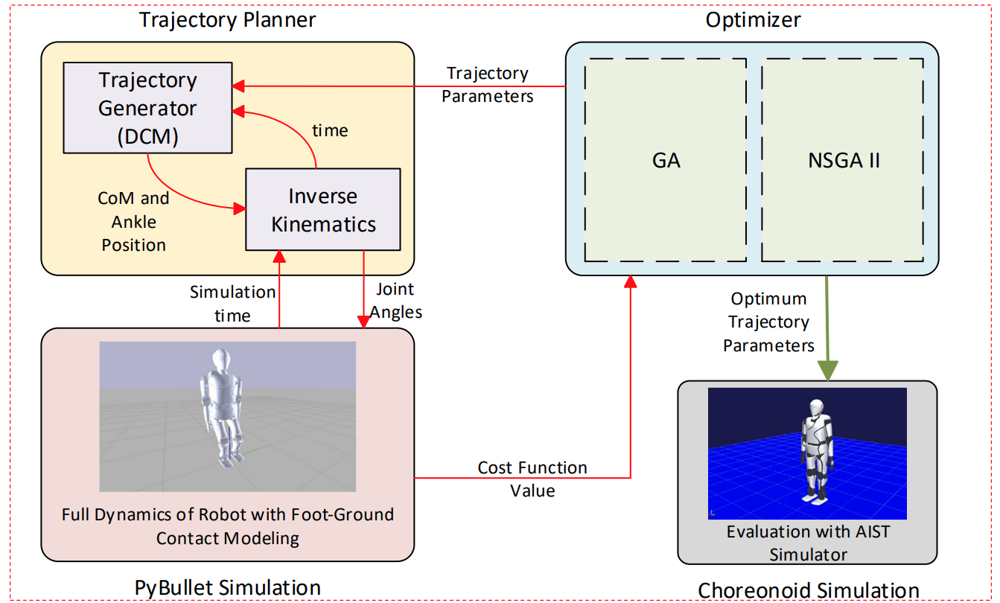

# Trajectory-Optimization
DCM based walking trajectory optimization of SurenaV
- - -
This repository contains the ROS based framework used for optimizing trajectory planning of *Surena Humanoid* Robot. Surena is an Iranian humanoid robot designed and fabricated in the Center of Advanced Systems and Technology of the University of Tehran. Feel free to visit our websites for more info about this project at [Persian Website](http://castech.ir/) or [English Website](http://cast-tech.ir/) 
## Description
The trajectory planning method used to generated gait patterns for bipedal robot utilizes Linear Inverted Pendulum Model (LIPM) which is a simplified model of humanoid robots. The trajectory planning and explicit formula for CoM, ZMP and DCM have been derived in [1]. The algorithm has several parameters:  
<ul>
    <li> <b>α:</b> defines the start time of double support phase</li>
    <li><b>tstep:</b> defines step duration</li>
    <li><b>tDS:</b> defines double suport phase duration</li>
	<li><b>∆z:</b> defines CoM height</li>
	<li><b>rF:</b> defines desired foot placements</li>
</ul>
We had to find the best set of abovementioned values for our robot so that it can walks at our desired pace with maximum stability and minimal power consumption. To do that, we used the Genetic algorithm. For more information about this, you can read our paper located in ICRoM2021 folder.

* * *

## Notes on Implementation
### Brief Overview of Codes
There are four main ROS nodes in this package:
<ul>
    <li>trajectory_planner: generates CoM and Ankle Trajectory given any walking parameters (ROS Service: traj_gen), it also solves inverse kinematics and returns all joint angle values given a simulation time (ROS Service: jnt_angs)</li>
    <li>bullet_main: It is the main simulation environment using bullet physics engine. Thanks to this node we can calculate different cost functions for our optimization based on the <b>full dynamics of bipeda robot</b>. </li>
    <li>optimizer_server: solves the single-objective optimization</li>
	<li>multiobjective: solves the multi-objective optimization</li>
</ul>

### Build and Run

&#9888 This package depends on ROS, pybullet, pymoo and geneticalgorithm library. 
&#9888 Correct the path of your own robot's mesh files and urdf in bullet_sim/bullet_main.py. 

To run the simulation do as follows:

1. Place the urdf file of your robot in *Trajectory-Optimization/bullet_sim/* and make sure that the first 12 joints are right and left leg joints respectively.
2. build package with catkin: `catkin build`
3. start ROS master: `roscore`
4. invoke all nodes with the launch file: `roslaunch bullet_sim optimization.launch`
This will start the multi-objective optimization with all four cost functions. To run the single-objective optimization replace `multiobjective.py` with `optimizer_server.py`. There is no need to re-build after the modifications.
  Check out our conference papers to find out about final result of our work [2].

* * *

## References
[1]	J. Englsberger, C. Ott, A. Albu-Sch¨affer. (2013)."Three-dimensional bipedal walking control using Divergent Component of Motion". International Conference on Intelligent Robots and Systems. 
[2] AH. Vedadi, K. Sinaei, P. AbdolahNejad, S. AbouMasoudi, AY. Koma. 2021. “Optimizing DCM 
Based Trajectory Generation Parameters for SURENA Humanoid Robot”. ICRoM 2021. Tehran. Iran 
